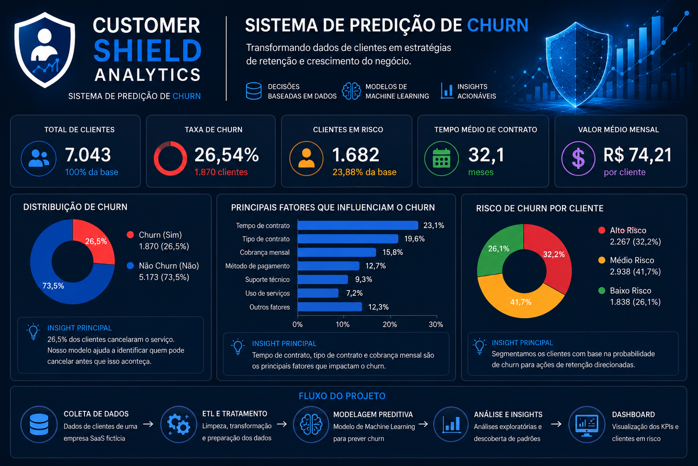

# Customer Shield Analytics —Sistema de Previsão de Cancelamento de Clientes
## 📊 Dashboard Preview

## 📌 Overview
Customer Shield Analytics is an end-to-end data project designed to simulate a real SaaS customer retention system.

The goal is to identify customers at risk of churn (cancellation) and support data-driven retention strategies using analytics and machine learning.

---

## 🎯 Business Problem
Subscription-based companies lose significant revenue due to customer churn.

In most cases:
- churn is detected after it happens
- there is no early warning system
- retention actions are reactive instead of proactive

This project addresses that gap by building a predictive system to identify at-risk customers before they leave.

---

## 🧠 Objective
Build a complete analytical system capable of:

- Predicting customer churn probability
- Identifying behavioral patterns linked to cancellation
- Segmenting customers by risk level (low, medium, high)
- Supporting proactive retention strategies with data

---

## ⚙️ Solution Architecture

1. Data ingestion (customer behavior dataset)
2. Data cleaning and transformation (ETL pipeline)
3. Exploratory Data Analysis (EDA)
4. Machine Learning model for churn prediction
5. Risk segmentation of customers
6. Business dashboard for decision-making

---

## 📊 Data Scope

The analysis focuses on customer-level behavioral and contract data, including:

- Tenure (customer lifetime)
- Monthly charges
- Contract type
- Payment method
- Service usage patterns
- Churn status (target variable)

---

## 🔧 Technologies Used

- Python (Pandas, NumPy, Scikit-learn)
- SQL (data structuring and queries)
- Machine Learning (classification models)
- Power BI (data visualization and dashboards)

---

## 📈 Key Deliverables

- Clean and structured dataset ready for analysis
- Exploratory Data Analysis (EDA) with business insights
- Machine learning model for churn prediction
- Customer risk segmentation model
- Interactive dashboard with KPIs

---

## 💡 Business Questions Answered

- Which customers are most likely to churn?
- What are the main drivers of customer cancellation?
- Are there identifiable behavioral patterns before churn?
- How can the company proactively reduce churn rate?

---

## 🤖 Machine Learning Approach

A supervised classification model is used to predict churn probability.

Output:
- Churn probability score per customer
- Risk classification:
  - Low risk
  - Medium risk
  - High risk

This enables proactive decision-making for retention strategies.

---
## 📊 Resultados do Modelo

O modelo foi desenvolvido para identificar clientes com alta probabilidade de churn, permitindo ações preventivas de retenção.

### Métricas de Desempenho

Acurácia: XX%
Precisão: XX%
Recall: XX%
Pontuação F1: XX%
ROC-AUC: XX%

> *As métricas serão atualizadas após a validação final do modelo.*
---
## 📊 Resultados do Modelo

O modelo foi desenvolvido para identificar clientes com alta probabilidade de churn, permitindo ações preventivas de retenção.

> As métricas de desempenho serão adicionadas após a validação final do modelo.
---

## 📷 Visualizações do Projeto
---
### Dashboard Executivo
O dashboard executivo foi desenvolvido para monitorar indicadores estratégicos de churn, segmentação de clientes e métricas de retenção, permitindo uma visão consolidada para apoio à tomada de decisão.
---
### Principais Insights

* Clientes com contratos mensais apresentam maior risco de churn.
* Clientes com menor tempo de permanência possuem maior probabilidade de cancelamento.
* Métodos de pagamento específicos demonstram correlação com taxas mais elevadas de churn.
* A segmentação por risco permite direcionar campanhas de retenção de forma mais eficiente.

---

## 🎯 Recomendações de Negócio

Com base na análise dos dados e nos resultados do modelo, recomenda-se:

* Criar campanhas de retenção para clientes classificados como Alto Risco.
* Incentivar contratos de longo prazo.
* Monitorar continuamente clientes recém-adquiridos.
* Desenvolver programas de fidelização para aumentar o Customer Lifetime Value (CLV).
* Utilizar o score de churn para priorizar ações do time de Customer Success.

---

## 👨‍💻 Autor

**Marcos Feitosa**

Analista de Dados com foco em Business Intelligence, Power BI, SQL, Python e Machine Learning.

### Contato

* LinkedIn: https://www.linkedin.com/in/marcosfeitosa-analista/
* GitHub: https://github.com/MarcosFeitosa0408
* Portfólio: https://marcosfeitosa0408.github.io/portfolio/

## 💼 Business Impact

This system simulates a real-world retention analytics solution that helps companies:

- Reduce customer churn
- Improve customer lifetime value (CLV)
- Optimize retention campaigns
- Support data-driven decision-making

---

## 🚀 Summary

A full end-to-end churn prediction system that transforms raw customer data into actionable business intelligence for retention strategy optimization.
